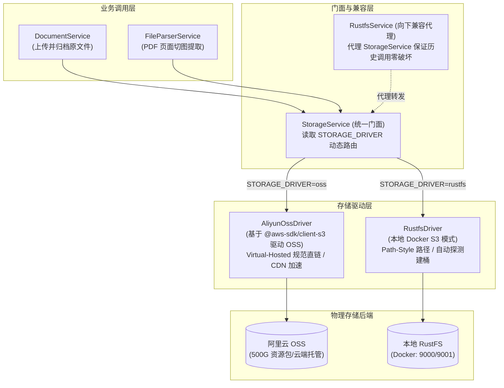

# 对象存储双模式（阿里云 OSS 与本地 RustFS）技术验证文档

> 分支：`v2-two-storage-mode`  
> 实施日期：2026-09-24  
> 实施目标：为系统实现统一的驱动策略模式存储层，支持一键切换生产级**阿里云 OSS**与本地离线**RustFS**，零额外冗余依赖，业务层零破坏。

---

## 一、 架构与设计



---

## 二、 关键设计要点

### 1. 0 冗余依赖原则
阿里云 OSS 原生完全兼容 AWS S3 API。本项目直接复用已引入的 `@aws-sdk/client-s3`，无需安装庞大的第三方 SDK（如 `ali-oss`），实现：
- 零额外体积包引入；
- 统一现代 TypeScript 严格类型；
- S3 Client 原生连接池与超时重试机制。

### 2. 标准公网直链生成
- **标准 Virtual-Hosted 格式**：`https://${bucket}.${endpointHost}/${key}`  
  例如：`https://my-bucket.oss-cn-hangzhou.aliyuncs.com/documents/2026/09/24/architecture-uuid.png`
- **支持 CDN / 自定义域名**：配置 `OSS_CUSTOM_DOMAIN=https://cdn.example.com` 时优先使用自定义直链：`https://cdn.example.com/documents/2026/09/24/architecture-uuid.png`。

### 3. 向下兼容与优雅平退
- 历史组件 `RustfsService` 完整保留并实现 `StorageDriver`，内部通过依赖注入平滑委托给 `StorageService`。
- 未显式配置 `STORAGE_DRIVER` 时：若检测到 `OSS_ACCESS_KEY_ID` 存在则自动优选 OSS，否则智能回退本地 RustFS。

---

## 三、 本地配置与使用指南

在你的本地 `apps/server/.env` 文件中，按需添加以下配置：

```env
# ===================================================================
# 对象存储 (Storage)
# 支持双存储模式：STORAGE_DRIVER=oss (阿里云 OSS) | rustfs (本地 RustFS)
# ===================================================================
STORAGE_DRIVER=oss

# --- 模式一：阿里云 OSS ---
OSS_ENABLED=true
OSS_REGION=oss-cn-hangzhou                   # 你的 Bucket 地域
OSS_BUCKET=your-bucket-name                  # 你的 Bucket 名字
OSS_ACCESS_KEY_ID=LTAI5t...                  # 刚才创建的子账号 AccessKey ID
OSS_ACCESS_KEY_SECRET=...                    # 刚才保存的子账号 AccessKey Secret
# 可选：自定义加速或 CDN 域名
OSS_CUSTOM_DOMAIN=
# 可选：自定义 Endpoint（留空自动使用 https://${OSS_REGION}.aliyuncs.com）
OSS_ENDPOINT=

# --- 模式二：本地 RustFS（备用） ---
RUSTFS_ENABLED=true
RUSTFS_ENDPOINT=http://localhost:9000
RUSTFS_ACCESS_KEY=rustfsadmin
RUSTFS_SECRET_KEY=rustfsadmin
RUSTFS_REGION=us-east-1
RUSTFS_BUCKET=knowledge-hub
RUSTFS_PUBLIC_URL=http://localhost:9000
```

> [!TIP]
> 切换到阿里云 OSS 后，如果你不需要本地 RustFS，可在 `docker-compose.yml` 中注释掉 `rustfs` 服务或执行 `docker stop knowledge_hub_rustfs`，彻底释放本地 9000 与 9001 端口以及数据卷资源。

---

## 四、 自动化验证结果

### 1. TypeScript 类型检查
```bash
pnpm --filter @knowledge-hub/server typecheck
```
**结果**：`tsc --noEmit -p tsconfig.json` 退出码 `0`，全工程 0 类型错误。

### 2. 单元测试与回归套件
```bash
pnpm --filter @knowledge-hub/server test
```
**结果汇总**：
- **测试文件**：15 passed | 2 skipped (全通过)
- **测试用例**：79 passed | 23 skipped (全通过)
- **重点覆盖**：
  - `src/storage/drivers/aliyun-oss.driver.spec.ts` (5 tests):
    - `OSS_ENABLED=false` 禁用判断
    - 缺少 Key / Bucket 凭据检测
    - 未启用抛出 `ServiceUnavailableException`
    - 标准阿里云 Virtual-Hosted 公网直链组装
    - `OSS_CUSTOM_DOMAIN` 自定义 CDN 域名替换
  - `src/storage/storage.service.spec.ts` (4 tests):
    - `STORAGE_DRIVER=oss` 路由委托
    - `STORAGE_DRIVER=rustfs` 路由委托
    - 未显式配置但 OSS 可用时优选 OSS
    - 未显式配置且 OSS 不可用时降级 RustFS
  - `src/document/document.service.spec.ts` (12 tests):
    - 原文件上传与解析全链路回归通过
