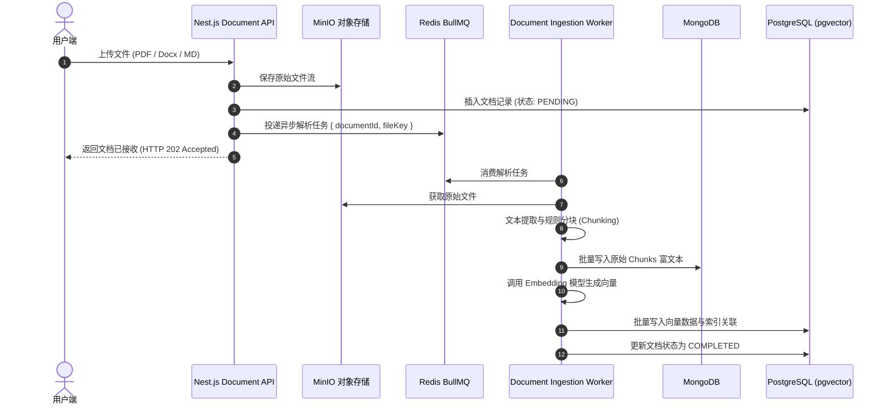
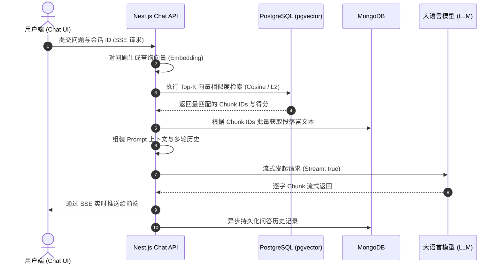

# 知识库项目架构设计与工程骨架规格说明书 (knowledge-hub)

## 1. 项目背景与目标

本项目旨在构建一个高可用、易扩展的企业级知识库问答与检索系统（knowledge-hub）。系统核心能力包含多格式文档解析摄取、智能分块、向量化索引与混合检索、以及基于大模型的流式 RAG 对话问答。

考虑到长期可维护性与多人协同开发，项目采用 **Monorepo（单仓多包）** 架构。前期聚焦于后端核心服务与基础设施的落地，前端应用预留规范占位，后续可随时无缝接入。

---

## 2. 总体技术栈与核心组件

| 模块 / 维度 | 选用技术 / 工具 | 职责说明 |
| :--- | :--- | :--- |
| **代码仓库模式** | pnpm Workspace + Turborepo | 统一依赖管理、增量构建编排、类型共享 |
| **后端主服务** | Nest.js (TypeScript) | 企业级模块化后端，提供 RESTful API 与 SSE 流式问答 |
| **前端应用** | React + Tailwind CSS (阶段占位) | 后续用于构建知识库文档管理与 AI 问答工作台 |
| **关系型及向量数据库** | PostgreSQL 16 + pgvector | 存储用户权限、知识库元数据，并直接提供高维向量相似度检索（HNSW） |
| **非结构化文档库** | MongoDB 7.0 | 存储长文档分块富文本、解析后 AST 结构、多轮对话审计记录 |
| **对象存储** | MinIO | 存储原始上传的 PDF、Word、Markdown、图片等文件 |
| **缓存与异步队列** | Redis 7 + BullMQ | 提供高吞吐异步任务队列（文档切片与向量化耗时管道）、分布式锁与状态缓存 |
| **本地开发编排** | Docker Compose | 一键在本地拉起 Postgres (pgvector)、Redis、MinIO、MongoDB 容器集群 |

---

## 3. 极简基础工程拓扑结构 (KISS & YAGNI)

```text
knowledge-hub/
├── apps/
│   ├── server/                # [后端核心服务] 官方 @nestjs/cli 生成的原生 Nest.js 应用（默认极简结构）
│   │   ├── src/
│   │   │   ├── app.controller.ts
│   │   │   ├── app.controller.spec.ts
│   │   │   ├── app.module.ts
│   │   │   ├── app.service.ts
│   │   │   └── main.ts
│   │   ├── nest-cli.json      # Nest 官方 CLI 配置文件
│   │   ├── package.json       # @knowledge-hub/server
│   │   ├── tsconfig.json
│   │   └── tsconfig.build.json
│   │
│   └── web/                   # [前端占位目录] 暂不建复杂结构，仅保留说明文档
│       └── README.md          # 说明文档（记录后续接入 React + Tailwind 的指引）
│
├── docker/                    # 本地基础设施容器化配置（用时再启动）
│   └── docker-compose.yml     # 包含 Postgres+pgvector, Redis, MinIO, MongoDB 标准服务
│
├── .gitignore
├── package.json               # 根 package.json（包含 dev:server 等统一脚本）
├── pnpm-workspace.yaml        # 工作区声明（关联 apps/* 与 packages/*）
└── README.md                  # 项目总体说明
```


---

## 4. 后端 Nest.js 模块划分与职责

后端 `apps/server` 将完全遵循 Nest.js 依赖注入与领域驱动分层思想：

1. **`common/` 通用基础设施层**：
   - `filters/all-exceptions.filter.ts`：全局标准异常处理，输出统一的 JSON 错误响应结构 `{ code, message, timestamp, path }`。
   - `interceptors/transform.interceptor.ts`：统一正常响应报文封装 `{ success: true, data: T }`。
   - `guards/jwt-auth.guard.ts`：接口认证拦截。

2. **`database/` 持久化集成层**：
   - **Postgres 模块**：集成 Prisma ORM（或 TypeORM），接入 pgvector 处理 `documents` 与 `embeddings` 关系。
   - **MongoDB 模块**：集成 Mongoose，维护 `chunks` 集合（存储解析后的原始段落文本及元数据）与 `chat_histories` 集合。
   - **Redis 模块**：提供 IoRedis 连接实例，注入给缓存与会话层使用。

3. **`storage/` 存储适配层**：
   - 封装 MinIO 客户端 SDK，提供 `uploadFile(file, bucket)`、`getPresignedUrl(key)`、`deleteFile(key)` 方法。

4. **`queue/` 异步任务管道**：
   - 基于 BullMQ 建立 `document-ingestion-queue`。上传大文档后，将切片分块、向量化请求推入队列，由后台 Worker 异步并发执行，避免长请求阻塞 HTTP 连接。

5. **`modules/` 核心业务领域**：
   - `modules/knowledge`：知识库空间管理、成员权限、统计指标。
   - `modules/document`：文档上传、解析状态追踪、删除级联清理。
   - `modules/rag`：文本分块器（Chunker）、向量化服务（Embedder）、混合检索器（Retriever）。
   - `modules/chat`：多轮对话会话、SSE 流式响应（兼容 Vercel AI SDK 协议）。

---

## 5. 核心数据流设计

### 5.1 文档入库与切分向量化流程


### 5.2 知识库问答检索流程


---

## 6. 实施演进步骤

### 阶段一：Monorepo 骨架与本地容器集群（当前重点）
1. 建立根目录 `package.json`、`pnpm-workspace.yaml`、`turbo.json`、`.gitignore`。
2. 编写 `docker/docker-compose.yml`，编排 Postgres (with pgvector)、Redis、MinIO、MongoDB，验证一键拉起。
3. 创建 `apps/web/` 占位目录及使用指南。
4. 使用官方 `@nestjs/cli` 构建 `apps/server`，配置为 pnpm 依赖管理。
5. 建立 `packages/shared` 与 `packages/tsconfig`，配置跨包类型引用。

### 阶段二：后端数据层与基础组件贯通
1. 完成 PostgreSQL + pgvector、MongoDB、Redis、MinIO 连接封装。
2. 跑通 BullMQ 任务队列。

### 阶段三：RAG 管道与流式对话
1. 实现文档解析分块与向量化。
2. 对接 LLM 实现 SSE 流式问答。

### 阶段四：前端开发
1. 在 `apps/web` 下正式初始化 React + Tailwind CSS，对接后端。
