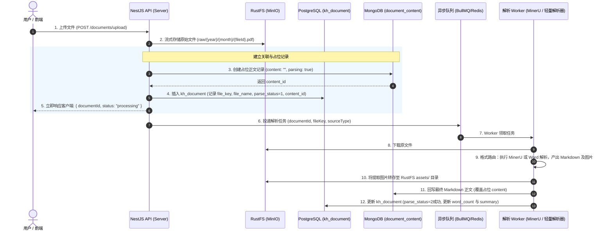

# 知识库文档接入与多模态解析架构设计备忘

> **文档状态**：设计备忘 / 待实施  
> **创建日期**：2026-09-15  
> **关联模块**：`apps/server` (Document / Storage / Ingestion)

---

## 1. 背景与核心目标

本文档记录了关于知识库**文档解析引擎（MinerU）、对象存储（RustFS/MinIO）、双存储元数据关联与多输入源平滑兼容**的技术设计。

当前服务端已实现基于 PostgreSQL（元数据）+ MongoDB（长文本正文）的基础 CRUD 接口。为了在后续接入复杂文件（PDF、Word 等）自动化解析流程时不推翻现有架构，特沉淀此设计指南作为后续迭代演进的标准。

---

## 2. 解析引擎选型与格式路由矩阵

### 2.1 MinerU 的定位与能力边界
**MinerU**（上海人工智能实验室开发）是专为复杂排版、多模态文档提取而生的高精度工具：
- **核心强项**：多栏排版阅读流重构、数学公式识别并转为 LaTeX、无框/合并单元格复杂表格提取、扫描件高精度 OCR。
- **天然支持格式**：PDF、单张/成套文档图片（JPG/PNG/WebP）、网页（HTML/URL 清洗去噪）、电子书（EPUB）。
- **运行特征**：基于 Python、PyTorch 与深度学习视觉模型（YOLO/LayoutLM 等），需独立显卡（GPU）或高配 CPU 运行，适合作为**独立微服务（Docker/FastAPI）或云端 Open API** 接入，不宜直接内嵌至 Node.js 进程。

### 2.2 全格式解析分流策略（Strategy Pattern）
企业知识库应坚持 **“轻重分离、各司其职”**，避免用重型视觉模型解析结构化文件：

| 文件格式 | 推荐处理引擎 | 处理方式与选型理由 |
| :--- | :--- | :--- |
| **PDF / 扫描件 / 截图** | **MinerU** | 专攻多栏、复杂表格、学术公式与扫描件 OCR |
| **Word (.docx)** | **mammoth / pandoc** | Node.js 本地轻量解析，毫秒级提取标准 XML 语义，零 GPU 依赖 |
| **Excel (.xlsx, .csv)** | **xlsx (SheetJS) / csv** | 原生提取行列单元格，直接转为 Markdown 表格或结构化 JSON |
| **HTML / Webpage** | **cheerio + turndown** | DOM 清洗剥离导航与广告，极速转换为纯净 Markdown |
| **PPT (.pptx)** | **LibreOffice + MinerU** | 先无头转 PDF 再走多模态视觉解析；或直接提取纯文本大纲 |

---

## 3. 原文件与解析文档的关联模型

### 3.1 关联必要性
如果仅保存解析后的 Markdown，丢弃对象存储中的原始文件，将产生如下架构缺陷：
1. **无法溯源与下载原件**：用户无法核验原始合同、报告盖章细节，无法重新下载原件。
2. **无法重新解析（Re-parse）**：解析器升级或微调提示词时，无法对存量文档批量重新触发解析。
3. **精准引文定位受阻（RAG Citation）**：智能问答高亮显示“引用自原文档第 X 页第 Y 段”时必须依赖原件。
4. **状态不闭环**：解析大文件为耗时异步任务，必须由主实体承载解析生命周期。

### 3.2 实体字段扩展设计（PostgreSQL: `kh_document`）

在现有 `DocumentEntity`（`kh_document` 表）中扩展以下字段（**全部设计为可空或带默认值，确保向下兼容**）：

```typescript
// 伪代码示例：DocumentEntity 扩展属性
export class DocumentEntity {
  // ... 现有字段: id, title, contentId, summary, categoryId 等 ...

  /** 文档来源类型：0 在线直接创建 / 1 文件上传导入 / 2 网页URL爬取 */
  @Column({ name: 'source_type', type: 'smallint', default: 0 })
  sourceType: number;

  /** 存储在 RustFS / MinIO 中的对象 Key（如: raw/2026/09/snowflakeId.pdf） */
  @Column({ name: 'file_key', type: 'varchar', nullable: true })
  fileKey?: string | null;

  /** 原始上传文件名（如: 2024Q3季度研报.pdf） */
  @Column({ name: 'file_name', type: 'varchar', nullable: true })
  fileName?: string | null;

  /** 原始文件大小（字节数） */
  @Column({ name: 'file_size', type: 'bigint', nullable: true, transformer: bigintTransformer })
  fileSize?: string | null;

  /** 文件 SHA256 / MD5 哈希（用于秒传和防重） */
  @Column({ name: 'file_hash', type: 'varchar', nullable: true })
  fileHash?: string | null;

  /** 解析状态：0 待解析 / 1 解析中 / 2 成功 / 3 失败 */
  @Column({ name: 'parse_status', type: 'smallint', default: 2 })
  parseStatus: number;

  /** 解析失败异常日志记录 */
  @Column({ name: 'parse_error', type: 'text', nullable: true })
  parseError?: string | null;
}
```

### 3.3 衍生资产（图片与图表）防膨胀规范
- MinerU 从 PDF 中切分出的插图、表格截图等资产，**严禁使用 Base64 直接内联存入 MongoDB**。
- Worker 必须将图片上传至 RustFS（如 `assets/{documentId}/img_1.png`），并将 Markdown 里的相对路径替换为 RustFS 访问链接后再存入 MongoDB。

---

## 4. 全流程流水线（Pipeline）时序设计



---

## 5. 多源兼容规范（在线创建 vs 文件导入）

知识库必须同时支持**用户在线编辑器手写敲字**与**文件导入**两种业务形态，通过统一模型抹平差异：

### 5.1 场景差异矩阵

| 维度 | 方式一：现有接口（手动/在线编辑） | 方式二：文件上传导入解析 |
| :--- | :--- | :--- |
| **触发接口** | `POST /documents`（纯 JSON 传 `title`, `content`） | `POST /documents/upload`（`multipart/form-data`） |
| **`source_type`** | `0` (在线编辑) | `1` (文件上传) |
| **`file_key` 等文件字段** | 一律为 `null` | 记录 RustFS 真实路径与大小 |
| **`parse_status`** | 默认为 `2`（无需解析，即刻可用） | 初始为 `1` (解析中)，回调后置为 `2` (成功) |
| **下游使用（RAG / 检索）** | 没有任何差异，统一从 Mongo 读取 Markdown 文本进行分块与向量化 |
| **前端交互差异** | 仅展示常规文章编辑页 | 详情页右上角额外展示 **“下载原始附件”** 按钮 |

### 5.2 约束兼容保证
- **`kh_document.content_id` 保持 `NOT NULL UNIQUE`**：
  采用**占位写入策略**（上传瞬间先在 Mongo 插入一条带 `parsing: true` 标记的空内容文档并拿到 `_id`），这样 Postgres 原有的非空与唯一键约束完全不受破坏，系统逻辑高度对称。

---

## 6. 后续演进实施清单（Checklist）

待基础教程学习与初版 CRUD 稳定后，可按以下步骤实施升级：

- [ ] **Step 1: 数据库迁移**：为 PostgreSQL `kh_document` 表增加 `source_type`、`file_key`、`file_name`、`file_size`、`file_hash`、`parse_status`、`parse_error` 列。
- [ ] **Step 2: 对象存储适配**：封装 `@knowledge-hub/storage` 或 NestJS `StorageService`，统一封装 RustFS / MinIO 的上传与预签名读取。
- [ ] **Step 3: 上传接口与占位逻辑**：新增 `POST /documents/upload` 接口与对应的 `UploadDocumentDto`。
- [ ] **Step 4: 异步解析引擎集成**：
  - 接入 BullMQ 或轻量任务分发；
  - 本地/微服务部署 MinerU，完成 PDF -> Markdown + 图片上传闭环。
